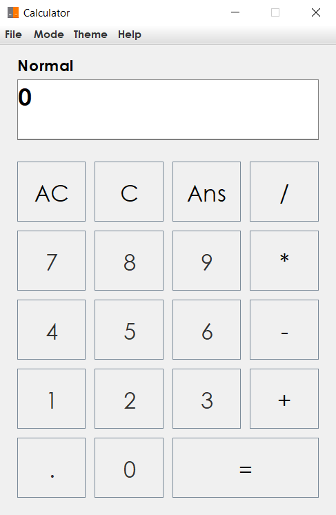
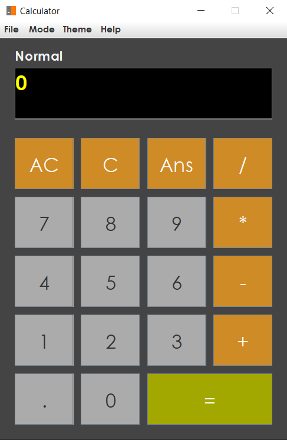

# Calculator

## FEATURES

* Basic Calculations
* Scientific Calculations
* Mapped button keys (keyboard)
* Theme selection
* Minimalist GUI

## KEYS

* **AC** - All Clear (Press “C” instead (on keyboard))
* **C** - Clear (Press “Backspace” instead (on keyboard))
* **/,x,-,+** - Divide (Press “/,*,-,+” instead (on keyboard))
* **=** - Equal (Press “Enter” instead (on keyboard))
* **.** - Point (Press “.” instead (on keyboard))
* **1,2,3,4,5,6,7,8,9,0**	- Numbers (Press “1,2,3,4,5,6,7,8,9,0” (on keyboard))
* **Ans** - Returns the last result.

 

## MANUAL

### Changing of mode (Normal || Scientific)
* To change mode to Scientific go to “menu > Mode > Scientific”. OR press **Ctrl + S** on your keyboard and press the same combination again to bring it back to Normal Mode.

### Switching to Dark Mode
* To switch to dark mode, go to “menu > Theme > Dark || Light”. OR press **Ctrl + D** to switch to Dark Mode and **Ctrl + L** to switch to Light Mode again.

### Syntax - Use of operations (Scientific Mode)
* % – Do not use any mathematical operations when using the percent sign. e.g, To get 22% of 168, you can enter 168%22.
* sqrt, 10^, sin, cos, tan, sinh, cosh, tanh, e(eulers), arcsin, arccos, arctan, ln, log – Operation first before numbers. e.g, sqrt25, cos5, ln12
* ^, ^2, ! – Number first before operation. e.g, 5^2, 4!